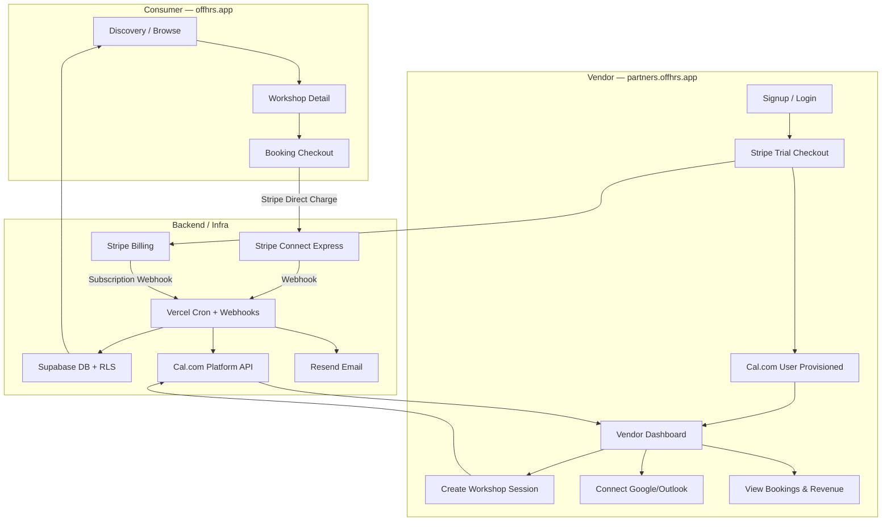
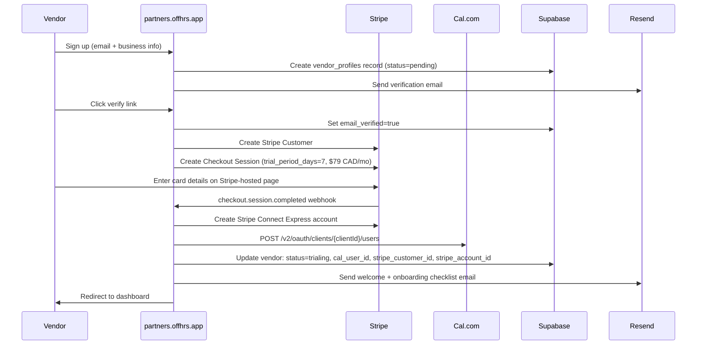
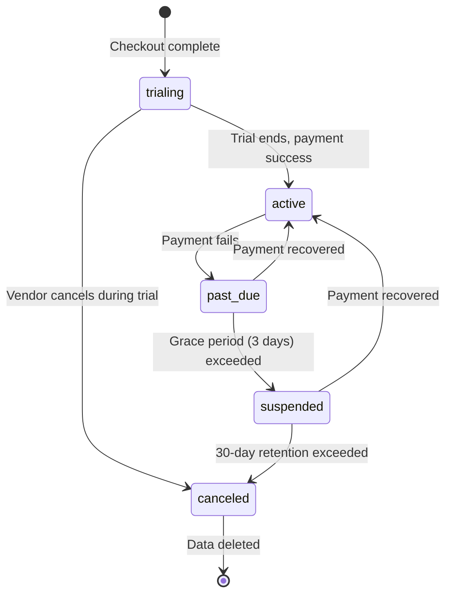
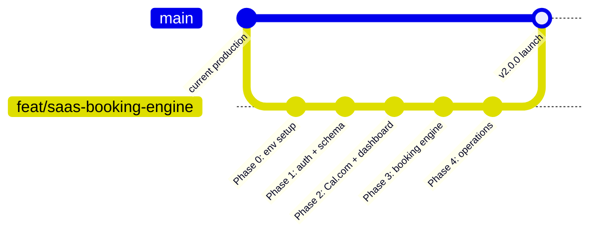

# offhrs SaaS Booking Engine — Product Requirements Document

**Version:** 1.0 | **Date:** May 6, 2026 | **Status:** Final Draft

---

## Table of Contents

1. [Executive Summary](#1-executive-summary)
2. [Business Model & Core Logic](#2-business-model--core-logic)
3. [Technical Stack & Infrastructure](#3-technical-stack--infrastructure)
4. [Architecture Overview](#4-architecture-overview)
5. [Routing & Infrastructure](#5-routing--infrastructure)
6. [Functional Requirements](#6-functional-requirements)
7. [Database Schema Changes](#7-database-schema-changes)
8. [New API Routes](#8-new-api-routes)
9. [New Environment Variables](#9-new-environment-variables)
10. [Additional Considerations](#10-additional-considerations)
11. [Development Workstream & Branch Isolation](#11-development-workstream--branch-isolation)
12. [Implementation Phases](#12-implementation-phases)

---

## 1. Executive Summary

offhrs is a Toronto-based B2B2C marketplace for creative workshops (pottery, floral, culinary). This document defines the requirements for pivoting the platform into a full **SaaS Booking Engine**. Vendors pay a monthly subscription to access a specialized dashboard (`partners.offhrs.app`) that manages payments, external calendar sync, and user bookings automatically via **Cal.com** and **Stripe**. The consumer-facing discovery app (`offhrs.app`) becomes the demand engine that drives bookings into vendor calendars.

---

## 2. Business Model & Core Logic

| Attribute | Detail |
|---|---|
| SaaS Subscription | $79 CAD/month (Standard Tier) |
| Free Trial | 7-day trial with auto-renewal on Day 8; no charge until trial ends |
| Vendor Revenue | 100% of ticket price minus Stripe processing fees (2.9% + $0.30 CAD) |
| offhrs Commission | 0% on ticket sales |
| offhrs Revenue | Monthly subscription fees only |
| Failed Payment | 3-day grace period → account suspended (read-only) → 30-day data retention → deletion |
| Cancellation | Vendor retains access until end of current billing period |

---

## 3. Technical Stack & Infrastructure

| Layer | Technology |
|---|---|
| Web Framework | Next.js 16 App Router (existing) |
| Styling | Tailwind CSS 4 + existing design system |
| Auth — Consumers | Supabase Auth (Google/Apple OAuth — existing) |
| Auth — Vendors | Supabase Auth (email/password) |
| Database | Supabase (PostgreSQL + RLS) |
| Scheduling | Cal.com Platform API (Managed Users) |
| Payments — Payouts | Stripe Connect Express |
| Payments — Subscriptions | Stripe Billing + Stripe Checkout |
| Email | Resend (existing) |
| Hosting | Vercel (subdomain routing via `vercel.json`) |
| Mobile | Expo (existing; read-only consumer experience in Phase 1) |

---

## 4. Architecture Overview



---

## 5. Routing & Infrastructure

### 5.1 Subdomain Routing (Vercel)

Extend `vercel.json` with host-based rewrites:

```json
{
  "crons": [
    { "path": "/api/cron/send-confirmation-emails", "schedule": "0 9 * * *" },
    { "path": "/api/cron/renew-recurring-events", "schedule": "0 1 * * *" },
    { "path": "/api/cron/refresh-cal-tokens", "schedule": "0 */12 * * *" }
  ],
  "rewrites": [
    {
      "source": "/:path*",
      "has": [{ "type": "host", "value": "partners.offhrs.app" }],
      "destination": "/partners/:path*"
    },
    {
      "source": "/:path*",
      "has": [{ "type": "host", "value": "offhrs.app" }],
      "destination": "/:path*"
    }
  ]
}
```

- `offhrs.app/partners` → marketing landing page (`src/app/partners/page.tsx`)
- `partners.offhrs.app/*` → vendor dashboard (`src/app/partners/...`) via rewrite

### 5.2 Middleware Updates

Extend `src/lib/supabase/middleware.ts` to:

- Protect all `/partners/*` routes except `/partners/login`, `/partners/signup`, `/partners/verify-email`
- Gate access by checking `vendor_subscriptions.status IN ('trialing', 'active', 'past_due')`
- Redirect suspended/canceled vendors to a locked state page with a reactivation CTA

---

## 6. Functional Requirements

### 6.1 Marketing Landing Page — `offhrs.app/partners`

**Goal:** High-conversion page targeting Toronto workshop vendors.

**Visual style:** Fresha-inspired — clean serif headings, warm neutral palette, generous whitespace. Default offhrs type scale.

**Sections (in order):**

| # | Section | Content |
|---|---|---|
| 1 | Hero | Headline: "Run your workshop business on autopilot." Sub-headline: pricing callout + "Start free 7-day trial" CTA |
| 2 | How It Works | 3-step visual: Sign up → Connect your calendar → Get bookings |
| 3 | Feature Grid | Instant booking, Stripe payouts, Google/Outlook sync, automated confirmations, availability management |
| 4 | Pricing Block | Single tier: $79 CAD/month, 7-day free trial, 0% commission |
| 5 | Social Proof | 2–3 vendor testimonial slots (placeholder at launch) |
| 6 | FAQ | Trial, billing, payout timing, Cal.com requirements, cancellation policy |
| 7 | Final CTA | Button redirects to `partners.offhrs.app/signup` |

**SEO requirements:** `application/ld+json` structured data (SoftwareApplication schema); `og:image` and Twitter card meta tags; canonical URL set to `https://offhrs.app/partners`.

---

### 6.2 Vendor Authentication

Vendors use **email + password** auth — separate from the consumer Google/Apple OAuth flow. Rationale: vendors are businesses; OAuth login creates friction in B2B onboarding.

| Route | Purpose |
|---|---|
| `/partners/signup` | Email, password, business name, phone number |
| `/partners/login` | Email + password with "Forgot password" link |
| `/partners/verify-email` | Token confirmation link from Resend email |
| `/partners/reset-password` | Supabase password reset flow |

Email verification is **required** before the vendor is redirected to Stripe checkout.

---

### 6.3 Vendor Onboarding Flow



**Error handling:**

- Cal.com provisioning fails → retry 3× with exponential backoff; alert offhrs admin; dashboard shows "Calendar setup pending" banner
- Stripe Connect onboarding incomplete → payouts paused; dashboard shows "Complete payout setup" banner; booking flow still active
- Checkout session expires → vendor can restart from the dashboard prompt

**Onboarding checklist fields** (tracked on `vendor_profiles`):

```
email_verified              boolean
stripe_checkout_completed   boolean
stripe_connect_completed    boolean
cal_connected               boolean  -- Google/Outlook linked via Atoms
first_session_created       boolean
```

Dashboard shows a persistent step-by-step checklist until all five are true.

---

### 6.4 Stripe Connect Express — Vendor Payout Account

- After `checkout.session.completed`, create a **Stripe Connect Express** account via `POST /v1/accounts`
- Redirect vendor to Stripe-hosted KYC onboarding via `account_links` API (`type: account_onboarding`)
- Store `stripe_account_id` on `vendor_profiles`
- All consumer payments use **destination charges** routed to the vendor's Connect account
- offhrs is the platform; Stripe processing fees are deducted automatically before payout
- Payout schedule: Stripe default (2-day rolling)
- Vendor accesses their own Express dashboard via login link: `POST /v1/accounts/{id}/login_links`

---

### 6.5 Stripe Billing — Subscription Management

- Product: **"offhrs Standard"** — $79 CAD/month
- Subscription created with `trial_period_days: 7`
- Billing portal enabled for self-serve plan management

**Webhook events handled at `/api/webhooks/stripe`:**

| Event | Action |
|---|---|
| `checkout.session.completed` | Trigger Cal.com provisioning + Stripe Connect creation |
| `customer.subscription.trial_will_end` | Send "Trial ending in 3 days" email |
| `customer.subscription.updated` | Sync status to `vendor_subscriptions` table |
| `customer.subscription.deleted` | Set vendor status → `canceled`; restrict write access |
| `invoice.payment_succeeded` | Set status → `active`; clear dunning flags |
| `invoice.payment_failed` | Set status → `past_due`; start 3-day grace period; send dunning email |
| `account.updated` (Connect) | Sync Stripe Connect onboarding completion state |

---

### 6.6 Cal.com Managed User Provisioning

offhrs is a **Cal.com Platform** customer. Each vendor gets their own **managed Cal.com user**.

**Provisioning sequence:**

1. `POST /v2/oauth/clients/{clientId}/users` → returns `{ accessToken, refreshToken, userId }`
2. Store tokens AES-256 encrypted in `vendor_cal_tokens` table
3. Vendor dashboard authenticates Cal.com Atoms via their `accessToken`

**Cal.com Atoms used in the dashboard:**

| Atom | Purpose |
|---|---|
| `<CalProvider />` | Wraps the entire dashboard with Cal.com context |
| `<Connect />` | Google Calendar / Outlook OAuth integration |
| `<AvailabilitySettings />` | Set working hours and blackout dates |
| `<EventTypeList />` | View and manage event types (workshop sessions) |
| `<BookerEmbed />` | Embedded on consumer workshop detail pages |

**Token refresh:** Vercel cron at `/api/cron/refresh-cal-tokens` runs every 12 hours and calls `POST /v2/oauth/{clientId}/refresh` for any tokens expiring within the next 24 hours.

---

### 6.7 Vendor Dashboard — `partners.offhrs.app`

**Navigation:** Persistent sidebar — Overview, Sessions, Calendar, Bookings, Payouts, Settings, Help.

#### Overview Tab

- KPI cards: active sessions, bookings this month, revenue this month (net of Stripe fees)
- Trial/subscription status banner with days remaining
- Action alerts: "Complete payout setup" (if Stripe Connect incomplete), "Connect your calendar" (if no Google/Outlook linked)
- Recent bookings feed (last 5)

#### Sessions Tab

- Filterable list of all workshop sessions by status: Published, Draft, Fully Booked, Archived
- **Create/Edit session form fields:**
  - Title, description, category (pottery / floral / culinary / other)
  - Price (CAD), max attendees, duration (minutes)
  - Date & time — single occurrence or recurring (weekly/monthly)
  - Location type: in-person (address) or virtual (link)
  - Hero image upload → stored in Supabase Storage `vendor-assets` bucket (5 MB max, `image/*`)
  - On save: `POST /v2/event-types` on Cal.com with `seatsPerTimeSlot = max_attendees`; upsert `events` row in Supabase

#### Calendar Tab

- Cal.com `<AvailabilitySettings />` Atom for working hours / blackout dates
- Cal.com calendar view showing upcoming sessions and individual bookings
- Fully booked sessions shown with a distinct badge

#### Bookings Tab

- Table columns: attendee name, email, session title, booking date, amount paid, Stripe charge ID, status
- Filters: date range, session, status
- Export to CSV
- Per-row "Issue Refund" button (calls Stripe Refunds API → triggers Cal.com booking cancellation → sends consumer cancellation email)

#### Payouts Tab

- "Open Stripe Dashboard" button — generates a Stripe Express login link
- Payout history table synced from `vendor_payouts` via Stripe webhook events

#### Settings Tab

- Business profile: name, bio, website URL, social links, profile photo
- Notification preferences: booking alerts (email), daily summary
- Refund policy: configurable refund window (hours before session), subject to platform minimum of 24 hours
- Change password
- Danger zone: Cancel subscription (access until period end), Delete account (immediate + 30-day data retention)

---

### 6.8 Consumer Booking Flow

```mermaid
sequenceDiagram
    participant U as Consumer
    participant App as offhrs.app
    participant DB as Supabase
    participant S as Stripe
    participant Cal as Cal.com
    participant R as Resend

    U->>App: Browse workshops, click "Book Now"
    App->>Cal: GET /v2/slots for event type
    U->>App: Select time slot, enter name + email
    App->>S: Create PaymentIntent (destination charge → vendor Connect account)
    U->>S: Complete payment (Stripe Elements embedded)
    S->>App: payment_intent.succeeded webhook
    App->>Cal: POST /v2/bookings (create booking on managed user event type)
    App->>DB: Insert bookings row
    App->>DB: Decrement available_slots; if 0 → set event status=fully_booked
    App->>R: Confirmation email to consumer (with .ics attachment)
    App->>R: Booking notification to vendor
    App->>R: Fully booked alert to vendor (if slots=0)
```

**Consumer `.ics` attachment fields:**

| Field | Value |
|---|---|
| SUMMARY | `[Vendor Name] — [Workshop Name]` |
| DTSTART / DTEND | Session date, time, and duration |
| LOCATION | Physical address or virtual link |
| URL | Vendor website |
| DESCRIPTION | Booking reference number |

---

### 6.9 Two-Way Calendar Sync

**Inbound (external calendar → offhrs):**

- Vendor connects Google or Outlook via the Cal.com `<Connect />` Atom (OAuth)
- Cal.com natively reads the external calendar and blocks any times marked busy
- No additional implementation required

**Outbound (offhrs booking → vendor calendar):**

- Cal.com natively writes confirmed bookings to the vendor's connected Google/Outlook calendar
- No additional implementation required

**Slot management (offhrs-specific):**

- `seatsPerTimeSlot` set to `max_attendees` when the Cal.com event type is created
- Cal.com marks a slot as unavailable once seats are filled
- offhrs mirrors this in the database via `payment_intent.succeeded` webhook (decrement `available_slots`; if `0` → `status = fully_booked`)
- Discovery page reflects "Fully Booked" badge in real time from the `events` table

**Cancellation sync:**

1. Consumer or vendor initiates cancel
2. `DELETE /v2/bookings/{uid}` called on Cal.com
3. Cal.com removes the event from vendor's external calendar
4. Stripe refund issued if within the vendor's configured refund window
5. Consumer receives cancellation email with a `.ics` `CANCEL` method file

**Rescheduling:**

1. Vendor reschedules from dashboard or Cal.com
2. `PATCH /v2/bookings/{uid}` called
3. Consumer receives updated `.ics` with new time

---

### 6.10 Webhook Handling

**New routes under `src/app/api/webhooks/`:**

| Route | Source | Purpose |
|---|---|---|
| `POST /api/webhooks/stripe` | Stripe | Billing + Connect lifecycle events |
| `POST /api/webhooks/cal` | Cal.com | Booking created / cancelled / rescheduled |

**Implementation requirements:**

- Signature verification before any processing (Stripe: `stripe.webhooks.constructEvent`; Cal.com: HMAC-SHA256 `x-cal-signature-256` header)
- All events logged to `webhook_events` table with `event_id` as unique key for **idempotency** — any duplicate delivery is a no-op
- Webhook handler response always returns `200` within 5 seconds; heavy work is queued asynchronously

**Cal.com events:**

| Event | Action |
|---|---|
| `BOOKING_CREATED` | Insert booking row, send emails, decrement slots |
| `BOOKING_CANCELLED` | Update booking status, trigger refund if eligible |
| `BOOKING_RESCHEDULED` | Update booking datetime, send updated `.ics` to consumer |

---

### 6.11 Email Notifications (Resend)

| Trigger | Recipient | Template Name |
|---|---|---|
| Signup | Vendor | `vendor-verify-email` |
| Onboarding complete | Vendor | `vendor-welcome` |
| Trial ending in 3 days | Vendor | `vendor-trial-ending` |
| Payment failed | Vendor | `vendor-dunning` |
| Account suspended | Vendor | `vendor-suspended` |
| New booking received | Vendor | `vendor-booking-notification` |
| Session fully booked | Vendor | `vendor-fully-booked` |
| Booking confirmed | Consumer | `consumer-booking-confirmation` + `.ics` |
| Booking cancelled | Consumer | `consumer-booking-cancelled` + `.ics CANCEL` |
| Booking rescheduled | Consumer | `consumer-booking-rescheduled` + updated `.ics` |
| Refund issued | Consumer | `consumer-refund-confirmation` |

All templates built with Resend's React email renderer. Vendor-facing emails use the offhrs brand; consumer-facing emails include the vendor's business name and branding.

---

### 6.12 Subscription Lifecycle & Access Control



**Feature gating by status:**

| Status | Dashboard Access |
|---|---|
| `trialing` | Full access |
| `active` | Full access |
| `past_due` | Full access + dunning banner with payment update CTA |
| `suspended` | Read-only (view bookings, export CSV); no new sessions; "Reactivate" CTA |
| `canceled` | Login disabled; data available via support request for 30 days |

---

### 6.13 offhrs Admin Panel Extensions

Extend existing `/admin/dashboard` (`src/app/admin/dashboard/page.tsx`) with a new SaaS Metrics tab:

**Platform KPIs:**

- Vendor counts by status: trialing, active, past_due, suspended, canceled
- MRR = active vendors × $79 CAD
- Churn rate (cancellations in last 30 days / active at start of period)
- Platform-wide bookings processed (MTD, all time)
- Platform GMV (total Stripe Connect volume)

**Vendor management table:**

- Columns: business name, email, status, trial end / next billing date, Cal.com connected, Stripe Connect complete, sessions created, bookings count
- Manual actions per vendor: extend trial (+N days), waive next invoice, force re-provision Cal.com user, impersonate (read-only view)

---

## 7. Database Schema Changes

### New Table: `vendor_profiles`

```sql
CREATE TABLE vendor_profiles (
  id                              uuid PRIMARY KEY DEFAULT gen_random_uuid(),
  user_id                         uuid REFERENCES auth.users(id) ON DELETE CASCADE,
  business_name                   text NOT NULL,
  slug                            text UNIQUE NOT NULL,
  bio                             text,
  website_url                     text,
  phone                           text,
  profile_photo_url               text,
  category                        text[],
  location_address                text,
  status                          text NOT NULL DEFAULT 'pending',
  -- pending | trialing | active | past_due | suspended | canceled
  stripe_customer_id              text UNIQUE,
  stripe_account_id               text UNIQUE,
  cal_user_id                     text UNIQUE,
  trial_ends_at                   timestamptz,
  subscription_current_period_end timestamptz,
  -- onboarding checklist
  email_verified                  boolean NOT NULL DEFAULT false,
  stripe_checkout_completed       boolean NOT NULL DEFAULT false,
  stripe_connect_completed        boolean NOT NULL DEFAULT false,
  cal_connected                   boolean NOT NULL DEFAULT false,
  first_session_created           boolean NOT NULL DEFAULT false,
  created_at                      timestamptz NOT NULL DEFAULT now(),
  updated_at                      timestamptz NOT NULL DEFAULT now()
);
```

### New Table: `vendor_subscriptions`

```sql
CREATE TABLE vendor_subscriptions (
  id                        uuid PRIMARY KEY DEFAULT gen_random_uuid(),
  vendor_id                 uuid REFERENCES vendor_profiles(id) ON DELETE CASCADE,
  stripe_subscription_id    text UNIQUE NOT NULL,
  stripe_price_id           text NOT NULL,
  status                    text NOT NULL,
  -- trialing | active | past_due | canceled | unpaid
  trial_start               timestamptz,
  trial_end                 timestamptz,
  current_period_start      timestamptz,
  current_period_end        timestamptz,
  cancel_at_period_end      boolean NOT NULL DEFAULT false,
  created_at                timestamptz NOT NULL DEFAULT now(),
  updated_at                timestamptz NOT NULL DEFAULT now()
);
```

### New Table: `vendor_cal_tokens`

```sql
CREATE TABLE vendor_cal_tokens (
  id            uuid PRIMARY KEY DEFAULT gen_random_uuid(),
  vendor_id     uuid REFERENCES vendor_profiles(id) ON DELETE CASCADE,
  access_token  text NOT NULL,   -- AES-256 encrypted
  refresh_token text NOT NULL,   -- AES-256 encrypted
  expires_at    timestamptz NOT NULL,
  created_at    timestamptz NOT NULL DEFAULT now()
);
```

### New Table: `webhook_events`

```sql
CREATE TABLE webhook_events (
  id           uuid PRIMARY KEY DEFAULT gen_random_uuid(),
  source       text NOT NULL,          -- 'stripe' | 'cal'
  event_id     text UNIQUE NOT NULL,   -- idempotency key
  event_type   text NOT NULL,
  payload      jsonb NOT NULL,
  processed_at timestamptz,
  error        text,
  created_at   timestamptz NOT NULL DEFAULT now()
);
```

### New Table: `vendor_payouts`

```sql
CREATE TABLE vendor_payouts (
  id                  uuid PRIMARY KEY DEFAULT gen_random_uuid(),
  vendor_id           uuid REFERENCES vendor_profiles(id) ON DELETE CASCADE,
  stripe_payout_id    text UNIQUE NOT NULL,
  amount_cad          numeric(10, 2) NOT NULL,
  arrival_date        date NOT NULL,
  status              text NOT NULL,  -- pending | paid | failed | canceled
  created_at          timestamptz NOT NULL DEFAULT now()
);
```

### Modified: `events` (existing table — additive columns only)

```sql
ALTER TABLE events
  ADD COLUMN vendor_profile_id  uuid REFERENCES vendor_profiles(id),
  ADD COLUMN cal_event_type_id  text,
  ADD COLUMN max_attendees      integer,
  ADD COLUMN available_slots    integer,
  ADD COLUMN price_cad          numeric(10, 2),
  ADD COLUMN duration_minutes   integer,
  ADD COLUMN status             text NOT NULL DEFAULT 'published';
  -- published | draft | fully_booked | archived
```

### Modified: `bookings` (existing table — additive columns only)

```sql
ALTER TABLE bookings
  ADD COLUMN cal_booking_uid          text UNIQUE,
  ADD COLUMN stripe_payment_intent_id text,
  ADD COLUMN stripe_charge_id         text,
  ADD COLUMN amount_cad               numeric(10, 2),
  ADD COLUMN stripe_fee_cad           numeric(10, 2),
  ADD COLUMN net_vendor_cad           numeric(10, 2),
  ADD COLUMN refunded_at              timestamptz,
  ADD COLUMN cancellation_reason      text,
  ADD COLUMN ics_sent                 boolean NOT NULL DEFAULT false;
```

---

## 8. New API Routes

### Vendor (partners.offhrs.app)

| Route | Method | Auth | Purpose |
|---|---|---|---|
| `/api/partners/signup` | POST | Public | Create vendor account + send verification email |
| `/api/partners/verify-email` | GET | Token | Confirm email verification token |
| `/api/partners/checkout` | POST | Vendor session | Create Stripe Checkout Session (7-day trial) |
| `/api/partners/connect-stripe` | POST | Vendor session | Create Stripe Connect Express account + return onboarding URL |
| `/api/partners/connect-stripe/refresh` | GET | Vendor session | Refresh expired Stripe Connect onboarding link |
| `/api/partners/portal` | POST | Vendor session | Create Stripe Billing Portal session for self-serve management |
| `/api/partners/cal/token` | GET | Vendor session | Return decrypted Cal.com access token for Atoms |
| `/api/partners/sessions` | GET | Vendor session | List vendor's workshop sessions |
| `/api/partners/sessions` | POST | Vendor session | Create session → Cal.com event type + Supabase event row |
| `/api/partners/sessions/[id]` | PUT | Vendor session | Update session → Cal.com event type update |
| `/api/partners/sessions/[id]` | DELETE | Vendor session | Archive session |
| `/api/partners/bookings` | GET | Vendor session | List bookings with filters; supports CSV export |
| `/api/partners/bookings/[id]/refund` | POST | Vendor session | Issue Stripe refund + cancel Cal.com booking |

### Webhooks

| Route | Method | Auth | Purpose |
|---|---|---|---|
| `/api/webhooks/stripe` | POST | Stripe signature | Stripe Billing + Connect webhook handler |
| `/api/webhooks/cal` | POST | Cal.com HMAC | Cal.com booking event handler |

### Consumer (offhrs.app)

| Route | Method | Auth | Purpose |
|---|---|---|---|
| `/api/book` | POST | Consumer session | Extended: create PaymentIntent with destination charge; confirm Cal.com booking on success |

### Cron

| Route | Schedule | Purpose |
|---|---|---|
| `/api/cron/refresh-cal-tokens` | Every 12 hours | Refresh Cal.com tokens expiring within 24 hours |
| `/api/cron/send-confirmation-emails` | Daily 9 AM | Existing — unchanged |
| `/api/cron/renew-recurring-events` | Daily 1 AM | Existing — unchanged |

---

## 9. New Environment Variables

```bash
# ── Stripe ────────────────────────────────────────────────────────────────────
STRIPE_SECRET_KEY                   # sk_live_... (sk_test_... in staging)
NEXT_PUBLIC_STRIPE_PUBLISHABLE_KEY  # pk_live_... (pk_test_... in staging)
STRIPE_WEBHOOK_SECRET               # Billing webhook signing secret (whsec_...)
STRIPE_CONNECT_WEBHOOK_SECRET       # Connect webhook signing secret (whsec_...)
STRIPE_STANDARD_PRICE_ID            # price_... for $79 CAD/mo product

# ── Cal.com Platform API ───────────────────────────────────────────────────────
CAL_API_KEY                         # Platform-level API key
CAL_OAUTH_CLIENT_ID                 # OAuth client ID for managed users
CAL_WEBHOOK_SECRET                  # HMAC secret for Cal.com webhook verification

# ── Token Encryption ──────────────────────────────────────────────────────────
TOKEN_ENCRYPTION_KEY                # 32-byte AES-256 key, base64-encoded
```

---

## 10. Additional Considerations

### 10.1 Vendor Slug & Public Profile Page

Each vendor gets an SEO-friendly public page at `offhrs.app/vendors/[slug]` extending the existing `/vendors/[id]` route. Slug is set at signup (auto-generated from business name, editable in Settings). The existing `vendors` table may be superseded by `vendor_profiles` — migration path to be defined in the Phase 1 migration script.

### 10.2 Cal.com Event Type ↔ offhrs Session Sync

When a vendor creates or edits a session:

1. `POST /v2/event-types` (or `PATCH`) on Cal.com under the managed user's context
2. Set `seatsPerTimeSlot = max_attendees`, `price`, `currency = CAD`, `length = duration_minutes`
3. Store `cal_event_type_id` on the `events` row
4. Consumer workshop detail page renders `<BookerEmbed eventTypeId={cal_event_type_id} />` Atom

### 10.3 Consumer Booking Widget

Replace the existing "Book Now" redirect (`event_redirects` table) with the Cal.com Booker Atom embedded on `/workshops/[id]` and `/vendors/[slug]` pages. Payment captured via Stripe Elements; Cal.com booking confirmed server-side after `payment_intent.succeeded`.

### 10.4 Refund & Cancellation Policy

- Platform minimum: full refund available up to **24 hours before session start**
- Vendor-configurable window (in hours) stored on `vendor_profiles.refund_window_hours`; defaults to 48 hours
- Enforced at `/api/partners/bookings/[id]/refund` — requests outside the window return `403`

### 10.5 Rate Limiting & API Security

- `/api/partners/*` routes protected by Supabase session JWT (Bearer token in `Authorization` header)
- `/api/webhooks/*` routes protected by signature verification only (no session required)
- `/api/book` rate limited to 10 requests per minute per IP using Vercel's built-in rate limiting or `@upstash/ratelimit`

### 10.6 PIPEDA & Canadian Data Compliance

- Supabase project region: `ca-central-1` if available; otherwise nearest compliant region
- Privacy Policy (`/privacy`) updated to disclose Stripe Connect data sharing and Cal.com data processing
- Stripe handles all PCI DSS compliance; offhrs never stores or transmits raw card data

### 10.7 Image Storage

- Supabase Storage bucket: `vendor-assets` — public read, authenticated write
- File size limit: 5 MB; MIME type enforced to `image/*` at the API layer
- Images served via Supabase CDN URL; Next.js `<Image />` component with domain configured in `next.config.ts`

### 10.8 Analytics & Observability

- Extend `/api/record-visit` to track `offhrs.app/partners` landing page views
- Add `vendor_analytics` table: daily bookings, daily revenue, daily page views per vendor
- Vercel Analytics enabled on `offhrs.app` and preview deployments
- Existing `daily_visits` cron pattern reused for platform-level metrics

### 10.9 Mobile App

The existing Expo app remains a read-only consumer experience in Phase 1. The vendor dashboard is web-only. Vendor mobile app is deferred to a future phase.

---

## 11. Development Workstream & Branch Isolation

This section ensures the existing `offhrs.app` consumer experience remains **fully functional and untouched in production** throughout all SaaS development.

### 11.1 Git Branch Strategy



| Branch | Purpose |
|---|---|
| `main` | Production — **never commit SaaS work here directly** |
| `feat/saas-booking-engine` | All SaaS development; single merge PR at launch |
| `feat/saas-phase-N` (optional) | Per-phase sub-branches merged into the feature branch via PRs |

**Hotfix rule:** Consumer app bugs are fixed directly on `main`, then `git merge main` into `feat/saas-booking-engine` to stay in sync.

**Branch creation (run once before any work begins):**

```bash
git checkout main
git pull origin main
git checkout -b feat/saas-booking-engine
git push -u origin feat/saas-booking-engine
```

### 11.2 Vercel Preview Environments

- `offhrs.app` (production) continues serving from `main` — **zero disruption**
- Every push to `feat/saas-booking-engine` gets an automatic Vercel preview URL (e.g. `offhrs-git-feat-saas-booking-engine-[hash].vercel.app`)
- `partners.offhrs.app` subdomain stays pointed at `main` until launch; use the Vercel preview URL for all staging validation

**Vercel dashboard action required:** Confirm Production Branch = `main` and preview deployments are enabled for all branches.

### 11.3 Supabase — Staging Project

| Action | Details |
|---|---|
| Create project | New Supabase project `offhrs-staging` (free tier) |
| Run migrations | All new SaaS migrations run against staging first |
| Env var scope | Staging Supabase credentials scoped to **Preview** in Vercel |
| Production DB | Never touched until the final launch merge |

**Environment variable split by Vercel scope:**

| Variable | Production scope | Preview scope |
|---|---|---|
| `NEXT_PUBLIC_SUPABASE_URL` | Production project URL | Staging project URL |
| `NEXT_PUBLIC_SUPABASE_ANON_KEY` | Production anon key | Staging anon key |
| `SUPABASE_SERVICE_ROLE_KEY` | Production service key | Staging service key |
| `STRIPE_SECRET_KEY` | Live key (`sk_live_...`) | Test key (`sk_test_...`) |
| `STRIPE_WEBHOOK_SECRET` | Live secret | Test secret |
| `CAL_API_KEY` | Production Cal.com | Cal.com sandbox |

### 11.4 Stripe — Test Mode

- All development and staging uses Stripe **test mode** keys
- Test card: `4242 4242 4242 4242` (any future date, any CVC)
- Stripe CLI (`stripe listen --forward-to localhost:3000/api/webhooks/stripe`) for local webhook development
- Separate Stripe Connect platform configuration registered in test mode

### 11.5 Cal.com — Sandbox

- Register a dedicated OAuth client in Cal.com Platform for development/staging
- Sandbox credentials stored in Vercel Preview env vars only (`CAL_API_KEY`, `CAL_OAUTH_CLIENT_ID`, `CAL_WEBHOOK_SECRET`)

### 11.6 GitHub Actions CI Update

Extend `.github/workflows/env-validation.yml` to also run on the feature branch and on PRs targeting it:

```yaml
on:
  workflow_dispatch:
  push:
    branches: [main, feat/saas-booking-engine]
  pull_request:
    branches: [main, feat/saas-booking-engine]
```

Add a second job to validate new SaaS env vars (`STRIPE_SECRET_KEY`, `CAL_API_KEY`, `TOKEN_ENCRYPTION_KEY`) when the branch is not `main`.

### 11.7 Launch Merge Protocol

When Phase 5 is complete and pilot vendors have signed off:

1. Open PR: `feat/saas-booking-engine` → `main`
2. **Pre-merge checklist:**
   - [ ] All Supabase migrations validated on `offhrs-staging`
   - [ ] Stripe Connect tested with a real vendor in live mode
   - [ ] Cal.com provisioning tested against production credentials
   - [ ] `vercel.json` subdomain rewrites reviewed
   - [ ] Vercel Production env vars updated (Stripe live keys, Cal.com production client, production Supabase)
   - [ ] `partners.offhrs.app` CNAME added in DNS and verified in Vercel
3. Run Supabase migrations against production via Supabase CLI (`supabase db push --db-url $PRODUCTION_DB_URL`)
4. Merge PR → Vercel auto-deploys to `offhrs.app` + `partners.offhrs.app`

---

## 12. Implementation Phases

### Phase 0 — Workstream Setup (Day 1, before any code)

- [ ] Create `feat/saas-booking-engine` branch from `main` and push to GitHub
- [ ] Create `offhrs-staging` Supabase project and copy schema baseline
- [ ] Configure Vercel Preview environment variables (staging Supabase, Stripe test mode, Cal.com sandbox)
- [ ] Register Cal.com Platform account + sandbox OAuth client
- [ ] Register Stripe Connect platform in test mode
- [ ] Update GitHub Actions CI to run on feature branch

### Phase 1 — Foundation (Weeks 1–3)

- [ ] `vercel.json` subdomain rewrites + cron additions
- [ ] Extend Next.js middleware for `/partners/*` route protection
- [ ] Vendor auth: signup, login, email verification, password reset
- [ ] DB migrations: `vendor_profiles`, `vendor_subscriptions`, `webhook_events`, `vendor_cal_tokens`, `vendor_payouts`; alter `events` and `bookings`
- [ ] Stripe Billing: Checkout Session creation + `/api/webhooks/stripe` subscription lifecycle handler
- [ ] Marketing landing page (`offhrs.app/partners`) — all sections, SEO meta

### Phase 2 — Core Dashboard (Weeks 4–6)

- [ ] Cal.com managed user provisioning (`POST /v2/oauth/clients/{id}/users`)
- [ ] Cal.com Atoms integration: `<CalProvider />`, `<Connect />`, `<AvailabilitySettings />`
- [ ] Session create/edit form → Cal.com event type sync
- [ ] Stripe Connect Express onboarding flow + account link refresh
- [ ] Vendor dashboard shell: sidebar navigation, Overview tab, onboarding checklist

### Phase 3 — Booking Engine (Weeks 7–9)

- [ ] Consumer booking flow: Stripe PaymentIntent with destination charge
- [ ] Cal.com `<BookerEmbed />` Atom on workshop detail pages
- [ ] `/api/webhooks/cal` handler: `BOOKING_CREATED`, `BOOKING_CANCELLED`, `BOOKING_RESCHEDULED`
- [ ] Slot decrement + fully-booked logic
- [ ] `.ics` file generation and Resend attachment
- [ ] All 11 email notification templates

### Phase 4 — Operations (Weeks 10–11)

- [ ] Vendor Bookings tab: table, CSV export, refund flow
- [ ] Vendor Payouts tab: Stripe Express login link + payout history
- [ ] `/api/cron/refresh-cal-tokens` cron job
- [ ] Admin dashboard SaaS metrics tab
- [ ] Rate limiting on `/api/book`
- [ ] Error monitoring setup

### Phase 5 — Polish & Launch (Week 12)

- [ ] SEO: `application/ld+json`, `og:image`, sitemap update
- [ ] PIPEDA compliance review + Privacy Policy update
- [ ] Load testing on booking + webhook endpoints
- [ ] DNS: add `partners.offhrs.app` CNAME in domain registrar
- [ ] Soft launch to 5 pilot vendors
- [ ] Execute launch merge protocol (§11.7)
