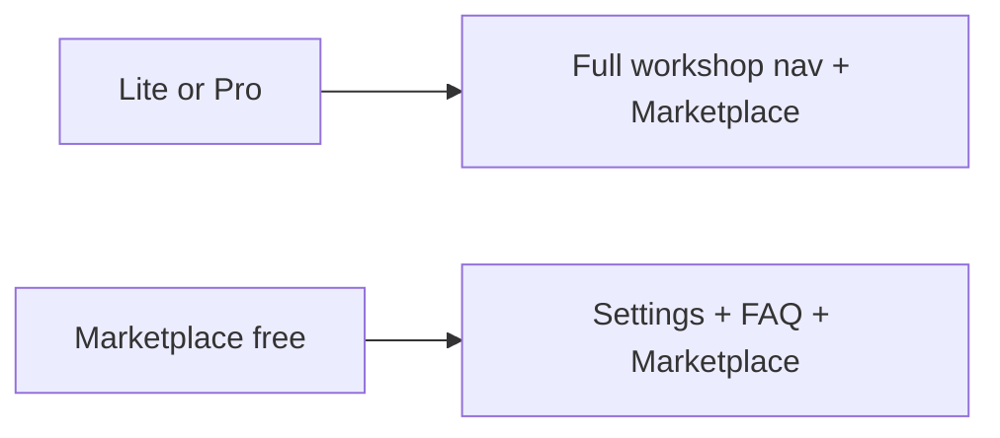
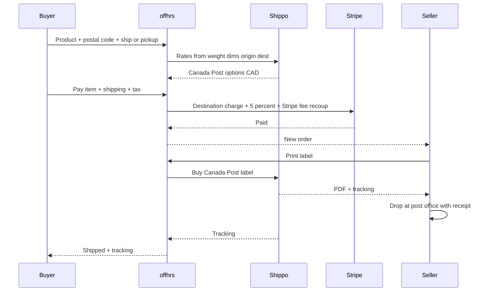

# Artist Marketplace Plan (FINAL)

> **Status:** FINAL — ready to execute engineering (Phase 1+) with Phase 0 legal/Shippo in parallel.  
> **Updated:** 2026-08-25  
> **Single source of truth:** this file only (`docs/ARTIST_SHOP_MARKETPLACE_PLAN.md`). Do not create duplicate plan copies.

---

## Execution readiness

| Question | Answer |
|----------|--------|
| Product decisions locked? | **Yes** — sellers, fees, Shippo, policies 1–9, mobile IA |
| Ready to write code (schema, Partners Marketplace, mobile Shop)? | **Yes — start Phase 1** |
| Ready for public launch tomorrow? | **No** — Phase 0 (counsel + Shippo account + facilitator tax registration) must complete before production GMV |
| Blocking unknowns? | None for build. Counsel confirms CRA facilitator duties and publishes Terms; ops opens Shippo platform account |

**Verdict:** Plan is **ready to execute**. Begin Phase 1 (access + catalog) immediately; run Phase 0 in parallel so checkout/labels (Phases 2–3) are not blocked on legal copy alone.

---

## Locked product decisions

| Decision | Choice |
|----------|--------|
| Who sells | **Lite/Pro Partners** (marketplace **included**) + **free Marketplace-only** artists |
| Money | **CAD only**, ship/sell **Canada only** |
| Shipping | **Live rates** via **platform Shippo** (Canada Post); seller **weight + dimensions**; buyer **postal code** |
| Labels | Seller **Print label** (prepaid PDF, platform Shippo) → drop at Canada Post |
| Label funding | Buyer pays shipping → funds platform Shippo label. No seller Shippo/CP accounts in v1 |
| Pickup | Optional local pickup ($0 shipping, no label) |
| Removed | Quote-after-order; seller zone/rate tables |
| Workshops | Unchanged: Lite/Pro + **0% booking commission** |
| Goods commission | **5%** + **Stripe separate** (~2.9% + $0.30). `SHOP_PLATFORM_FEE_BPS=500` |
| Commission base | **5% on item subtotal (ex-tax)**; not on postage or tax |
| Chargebacks | **Vendor liable** (amount + dispute fee) workshops + Marketplace; Stripe hits offhrs first under Express |
| Risk of loss | **First Scan** (in-transit); **Delivered** → porch-pirate risk on buyer |
| Ship-by SLA | **5 business days** default; Day-3 reminder; made-to-order extendable (shown at checkout) |
| Returns | “No remorse returns” allowed if disclosed; **damaged/SNAD mandatory** within **14 days** |
| High-value ship | Auto signature + full insurance above **$250**; cost to buyer |
| Tax (goods) | **Marketplace facilitator** — Stripe Tax collect/remit (counsel confirm CRA) |
| Platform protection | **None** in v1 — lost-in-transit capped at **carrier insurance** |
| Logistics | offhrs does not warehouse or drop off parcels |
| Mobile | Tabs **Home · Workshops · Bookings · Shop · Profile**; **no** Home Shop carousel; Profile **Orders \| Saved \| Reviews** |

**Fee math:** `application_fee_amount` = 5% of item subtotal + estimated Stripe fee on full charge. Never market goods as “0%.”

**Shippo tooling:** Postage buyer-funded; ~US$0.07/label API fee absorbed by offhrs in v1; APV/dims shortfalls clawed from seller.

Do **not** overload `events` / bookings. Parallel Shop domain; reuse Connect, tax patterns, partner auth, consumer shell.

---

## What exists today (constraints)

- Connect Express destination charges — `src/app/api/book/route.ts`, `src/app/api/partners/connect-stripe/route.ts`
- `losses.payments = application` → platform liable to Stripe first
- Workshop Stripe Tax — `src/lib/stripe-workshop-tax.ts`
- “0% commission” messaging must stay workshop-only after launch
- Mobile: Home / Workshops / Bookings / Profile — add Shop
- Thin dashboard: `DashboardShell`, `partner-access.ts`, `proxy.ts`

---

## Plan / dashboard access

| Plan | Price | Dashboard |
|------|-------|-----------|
| Lite / Pro | $29 / $49 CAD/mo | Existing tabs **+ Marketplace** |
| Marketplace free | $0 signup; 5% + Stripe on sales | **Marketplace + Settings + FAQ** only (Connect in Settings) |
| Shopify Sync only | unchanged | No Marketplace unless also Lite/Pro or Marketplace-free |

**Signup:** `/partners/signup?intent=marketplace`. Gates: Connect + tax + Canada attestation. `vendorHasMarketplaceAccess` = Lite/Pro **or** marketplace-free.

**Lite/Pro:** Marketplace included; first publish needs ship-from + attestation.

---

## Checkout + fulfillment

**Rules:** single PI; stale rate refresh; label after pay; fail → `paid_awaiting_label`; optional handling adder; inventory lock on pay.

**v1 non-goals:** multi-seller cart, international, EasyPost, seller Shippo, quotes, variants, discounts, returns portal, Platform Protection Guarantee.

---

## Consumer mobile app UX (locked)

### Tab bar

**Home · Workshops · Bookings · Shop · Profile**

- Shop **between** Bookings and Profile  
- **No** product carousel or Shop block on Home  

### Surfaces

| Surface | Role |
|---------|------|
| Home | Workshops only |
| Shop tab | Full-list discovery (Workshops chrome) |
| Product detail | Media, price, maker, ship/pickup, Buy |
| Checkout | Address → rates → tax → PaymentSheet |
| Profile **Orders** | Shop orders (Bookings = workshops only) |
| Vendor profile | Shop segment for that maker |

### Shop tab chrome

Mirror Workshops full list (`workshop-browse.tsx`, `WorkshopsChrome`):

- offhrs logo · search · **Category** · **Sort** · **Price** (not Distance)  
- Photo cards: image, title, price, maker  

### Profile stats row

**Orders | Saved | Reviews** (Orders leftmost; same stats strip as today)

### Seller on mobile

Partners **web** only for listings/labels in v1.

---

## Partner web — Marketplace tab

**Products:** status chips, bulk actions, fields (title, description, images, category, price, qty, weight/dims, fragile, pickup, made-to-order ship window, remorse return toggle, status). No variants.

**Orders:** filters; Print label; Mark picked up; cancel/refund pre-scan; tracking; notes.

**Shipping settings:** ship-from CA, handling fee, pickup, attestation.

**Payouts:** Lite/Pro existing tab; Marketplace-only → Connect in Settings.

---

## Domain model

- `vendor_profiles`: marketplace flags/plan, shop_status, ship-from, handling_fee, pickup, return_policy  
- `shop_products`: catalog + weight/dims + `ship_by_business_days` (default 5)  
- `shop_orders` / items / payments + Shippo ids, tracking, label URL, First Scan timestamps  
- Statuses: `paid_awaiting_fulfillment` → `label_purchased` → `shipped` → `completed`; pickup path; `cancelled` / `refunded` / `disputed`  
- Storage: `shop-product-images`

---

## APIs / surfaces

Partner CRUD + labels · consumer browse/checkout/orders · Stripe + Shippo + dispute webhooks · admin approve/refund/label retry · mobile Shop · web `/shop/[id]` · `emails.ts`

---

## Cost ledger

| Cost | Who pays |
|------|----------|
| 5% | Seller |
| Stripe ~2.9%+$0.30 | Seller (recoup) |
| CP postage | Buyer → Shippo label |
| Shippo ~$0.07/label | offhrs (absorb v1) |
| APV shortfall | Seller clawback |
| Chargeback + fee | Seller (Stripe→platform first) |

---

## Legal & compliance

**Not legal advice.** Counsel before public GMV.

**Update:** Terms of Use, Service Terms, Privacy, Content Policy, Data Protection, FAQ/pricing, Marketplace Seller Addendum.

### Chargeback draft (counsel review)

**Consumer:** Contact hello@offhrs.app before bank dispute; good-faith investigation; invalid chargebacks may incur disputed amount + Stripe fees + admin costs; recover via offset / payment method / suspend.

**Vendor:** Seller of record for workshops + Marketplace; authorize Connect debit/offset/invoice for disputed amount + ~CAD $15 fee + costs; evidence duty (labels, tracking, packing/pickup proof); offhrs not liable for seller misconduct/listing/fulfillment failures; abnormal rates → suspend.

**Ops:** `charge.dispute.created` → notify → evidence → clawback → suspend if needed.

### Locked fulfillment policies (1–9)

1. **First Scan + Delivered** — drop-off receipt required; lost-in-transit → CP claim; gap above insurance = seller; Delivered → porch pirate on buyer; no platform guarantee  
2. **SLA** — 5 business days; Day-3 reminder; custom/MTO window at checkout  
3. **Returns** — 14-day damaged/SNAD + photos; remorse may be no-returns if disclosed; SNAD cannot be waived; refuse → chargeback → Connect clawback  
4. **Cancel** — pre-First-Scan: full refund + void label; post-scan: block cancel  
5. **APV** — dims warranty; Connect clawback  
6. **$250+** — auto signature + full insurance (buyer pays)  
7. **Manual QA** — first Marketplace-only sellers  
8. **Facilitator tax** — Stripe Tax collect/remit (counsel)  
9. **PIPEDA** — address only for fulfillment; no marketing lists without opt-in  

---

## Implementation must-not-forget

Inventory race · idempotent label + void · postage not paid out as seller earnings · drop-off receipt UX · Day-3 + MTO SLA · $250 insurance · APV debit · SNAD/damaged · chargeback clawback · facilitator tax ops · PIPEDA clause · manual QA · account deletion PII · no XP on shop · Connect MCC · nav gating · FAQ 0% workshops-only · push/deep links · image compression · `/shop/[id]` share pages · App Store notes  

---

## Phased delivery

### Phase 0 — Legal + Shippo (parallel)

Counsel Terms; Shippo account; goods tax code + remittance; postage/APV ledger design

### Phase 1 — Access + catalog

Marketplace free + nav; Products CRUD + dims; Lite/Pro Marketplace tab; seller QA process

### Phase 2 — Checkout + mobile Shop

Shippo rates; CA validation; PI + 5%; pickup; SLA/$250 at checkout; Stripe Tax; Shop tab + Profile Orders

### Phase 3 — Labels + orders

Print label; First Scan; void-on-cancel; Day-3; emails; pre-scan refunds; APV hooks; admin

### Phase 4 — Harden

Disputes UI; auto clawback; SNAD/damaged; App Store/Play; release

---

## Checklist

- [x] Phase 0 (engineering): Terms + Marketplace Seller Addendum + FAQ + Shippo/fee/tax scaffolding + postage ledger design  
- [x] Phase 0 (ops/counsel): Shippo account + `SHIPPO_API_KEY`; counsel review; CRA facilitator registration; confirm `STRIPE_SHOP_GOODS_TAX_CODE` *(ops done for build; counsel/CRA deferred to production)*  
- [x] Phase 1: Access + Products CRUD + QA  
- [ ] Phase 2: Checkout + tax + mobile Shop  
- [ ] Phase 3: Labels + SLA + ledger  
- [ ] Phase 4: Disputes + launch  

---

## Success criteria

- Lite/Pro: Marketplace nav; free plan: Marketplace + Settings + FAQ only  
- Mobile: Shop between Bookings & Profile; Profile Orders | Saved | Reviews; no Home Shop carousel  
- Checkout: rates from weight/dims + postal; >$250 includes signature/insurance  
- Label print + tracking; drop-off receipt encouraged  
- Pre-scan cancel = refund + void; post-scan cancel blocked  
- Lost-in-transit / Delivered / SNAD / APV / chargebacks per locked policies  
- 5% + Stripe disclosed; postage not seller GMV; workshop 0% unchanged  
