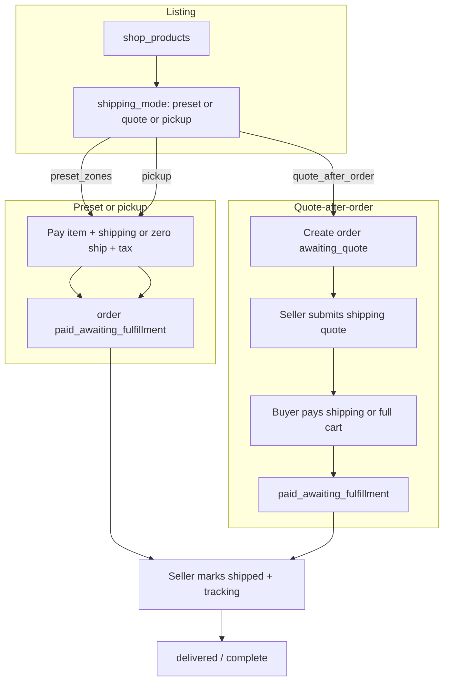

# Artist Shop Marketplace (CAD / Canada-only)

> **Status:** Planning only — not implemented.  
> **Saved:** 2026-08-21  
> **Also in Cursor:** `.cursor/plans/artist_shop_marketplace_80621ad4.plan.md` (may live under your user `.cursor/plans/` folder)

## Product decisions (locked)

| Decision | Choice |
|----------|--------|
| Who sells | **Both**: existing Lite/Pro Partners **and** standalone artist sellers |
| Money | **CAD only**, ship/sell **within Canada only** |
| Fulfillment | Per shop (or per listing): **(1) preset zones/rates**, **(2) quote-after-order**, plus **optional pickup** coordination |
| Logistics | offhrs does **not** warehouse, pack, or ship — sellers fulfill |
| Workshops | Unchanged: subscription + **0% booking commission**; goods use a **separate commission** |

Do **not** overload `events` / workshop bookings for physical goods. Build a parallel **Shop** domain that reuses Stripe Connect, tax helpers, partner auth patterns, and consumer app shell.

---

## What exists today (constraints)

- Workshops: Stripe Connect **Express**, **destination charges** + `on_behalf_of`, `application_fee_amount` ≈ **Stripe processing only** (not a platform take-rate) — `src/app/api/book/route.ts`, `src/app/api/partners/connect-stripe/route.ts`.
- Express accounts: `fees.payer = application`, `losses.payments = application` → **offhrs is liable for chargebacks/negative balances** on Connect — higher risk for shipped goods than for workshop seats.
- Tax: Stripe Tax for workshop tickets (`src/lib/stripe-workshop-tax.ts`); vendors opt into GST/HST via Settings.
- Messaging/legal: “0% commission”, workshop intermediary role — `src/app/terms/service-terms/page.tsx`, partner FAQ, partners marketing.
- Mobile: Workshops / Bookings / Profile tabs — no Shop surface (`offhrs-mobile/app/(tabs)/_layout.tsx`).
- No shipping, inventory SKU, or merchandise schema.

---

## Recommended commerce model

**Payment sequencing (concrete default):**

1. **Preset zones / pickup:** Single PaymentIntent for **item + shipping (0 if pickup) + tax**. Platform **application_fee** = configured **goods commission %** + estimated Stripe fee (same recoup pattern as workshops, plus take-rate).
2. **Quote-after-order:**
   - Create order in `awaiting_shipping_quote` with **item amount authorized or paid** (recommend **pay item immediately** so sellers are not stuck quoting ghost orders; shipping is a **second PaymentIntent** when buyer accepts the quote).
   - If buyer declines quote / timeout → item refund per policy; inventory released.
   - Alternative (do not use in v1): unpaid requests — higher abandonment and seller spam.

**Seller of record:** Seller is merchant for the goods and fulfillment. offhrs is payment facilitator / limited commercial agent (extend existing workshop language). Statement descriptor should remain seller-facing via `on_behalf_of` where possible.

---

## Domain model (new tables)

Keep workshops on `events` / `bookings`. Add:

### Identity / capability

- Extend `vendor_profiles` (or parallel `seller_profiles` linked 1:1):
  - `seller_kinds`: `workshop` | `shop` | `both` (Partners default workshop; can enable shop; standalone = shop-only).
  - `shop_enabled`, `shop_status` (`pending_review` | `active` | `suspended`).
  - Shop policies: default return window, processing days, Canada-only affirmation.
- Standalone artists: signup path **without** Lite/Pro workshop subscription. Locked choice: **Shop access = active Stripe Connect + approved shop + platform goods commission** (subscription optional later; do not require Lite/Pro for shop-only sellers).

### Catalog

- `shop_products`: vendor_id, title, description, medium/category, images[], price_cad, quantity (null = unlimited; 1 = unique), weight/dims optional, status (`draft`|`published`|`sold_out`|`archived`), `shipping_mode` override or inherit from shop, `allows_pickup`, `pickup_instructions`, created/updated.
- `shop_product_images` or storage bucket `shop-product-images` (mirror workshop image patterns).
- Categories: new shop taxonomy (ceramics, floral, painting, textile/tufting, jewelry, other) — **do not** reuse workshop category list blindly.

### Shipping config

- `shop_shipping_profiles` per vendor: mode defaults (`preset` | `quote` | `pickup_only`), max package rules.
- `shop_shipping_zones`: name (e.g. “GTA”, “Ontario”, “Rest of Canada”), destination match via **province list** and/or **postal prefixes** (Canada only; reject non-`CA`).
- `shop_shipping_rates`: zone_id, price_cad, estimated_days_min/max, label (“Standard”, “Local courier”).
- Pickup: studio address from vendor profile + optional `pickup_hours` / instructions; buyer selects `fulfillment_type = pickup | ship`.

### Orders

- `shop_orders`: buyer user_id, vendor_id, status enum, currency `cad`, item_subtotal, shipping_cad, tax_cad, total, platform_fee_cents, stripe_fee estimates, addresses (JSON + normalized), fulfillment_type, shipping_mode_used, tracking_number, carrier, timestamps (quoted_at, paid_at, shipped_at, delivered_at, cancelled_at).
- `shop_order_items`: product snapshot (title, price, qty), product_id FK.
- `shop_order_payments`: payment_intent_id, kind (`item` | `shipping` | `combined`), amount, status — supports two-charge quote flow.
- `shop_shipping_quotes`: order_id, amount_cad, message, expires_at, status (`pending`|`accepted`|`declined`|`expired`).
- Status machine (minimum):
  `awaiting_shipping_quote` → `awaiting_shipping_payment` → `paid_awaiting_fulfillment` → `shipped` → `completed`
  + `cancelled` / `refunded` / `disputed` side states.
  Preset/pickup skip quote states.

### Inventory

- Decrement on **successful item payment** (not on quote create alone if unpaid — with “pay item first”, decrement at first PI success).
- Restore on cancel/refund before ship.
- Unique pieces: `quantity = 1` → mark `sold_out` when ordered.

---

## Stripe / money

| Concern | Approach |
|---------|----------|
| Connect | Reuse Express onboarding; update `business_profile.product_description` / MCC when shop enabled (goods MCC e.g. art dealers / miscellaneous retail — confirm with Stripe). |
| Charge type | Destination + `on_behalf_of` + `application_fee_amount` |
| Platform take | Configurable `SHOP_PLATFORM_FEE_BPS` (e.g. 10% = 1000 bps) **plus** Stripe fee recoup (today’s workshop pattern) |
| Tax | New helper (mirror workshop tax): Stripe Tax code for **tangible goods**; customer **shipping address** drives tax; seller GST/HST registration flag reused or shop-specific |
| Payouts | Stripe Connect payouts to seller; offhrs never “holds” funds manually |
| Refunds | Extend patterns from `src/lib/booking-refund.ts`: item vs shipping legs; `refund_application_fee` policy explicit for commission |
| Chargebacks | Platform liable under current Express controller settings — budget reserves; evidence workflow (tracking, photos, comms) |

**Do not** market goods as “0% commission”. Update partner FAQ, pricing page, and App Store/Play copy where shop is mentioned.

---

## APIs (Next.js)

Partner/seller (auth + vendor ownership):

- CRUD products, images, shipping profiles/zones/rates
- List/manage orders; submit shipping quote; mark shipped + tracking; mark pickup ready / completed
- Shop settings (enable shop, policies)

Consumer:

- Browse/search products (filters: category, city/region, price, pickup available)
- Product detail; start checkout (address → zone rate or quote path)
- Accept/decline shipping quote; pay shipping PI
- Order history (parallel to Bookings)

Webhooks:

- Reuse Stripe payment_intent webhooks; add handlers for shop metadata (`shop_order_id`, `payment_kind`)
- Idempotency via existing `webhook_events` patterns

Admin:

- Approve/suspend shops; force-archive products; refund tools; dispute queue

---

## App / UX surfaces

### Partner dashboard (`src/app/partners/dashboard`)

- New **Shop** nav: Products, Orders, Shipping, Payouts (link Connect)
- Workshop-only Partners: optional “Enable Shop” checklist (Connect complete, tax settings, Canada shipping attestation)
- Shop-only sellers: thinner shell (no sessions/calendar) — reuse DashboardShell gating like Shopify Sync-only thinning

### Standalone artist signup

- New path `/partners/signup?intent=shop` (or `/sellers/signup`): business name, categories, address in Canada, Stripe Connect, tax settings, shop policies — **no** workshop subscription required
- Distinct from Lite/Pro and Shopify Sync intents already in `PartnerSignupWizard`

### Consumer mobile (`offhrs-mobile`)

- New **Shop** tab (or Home section + browse): product grid, detail, checkout, shipping address form (CA only)
- **Orders** under Profile or combined “Activity” with Bookings clearly separated
- Push/email deep links for “shipping quote ready”, “shipped”, “pickup ready”
- Apple Pay / PaymentSheet reuse from workshop booking

### Web consumer

- If workshops are primarily mobile-led, still add minimal web product pages for SEO/share links (`/shop/...`) consistent with public vendor pages

---

## Notifications

Extend `src/lib/emails.ts` (Resend):

- Buyer: order received, quote ready, payment receipt, shipped (+ tracking), pickup ready, refund
- Seller: new order, quote reminder, payment received, dispute/chargeback alert
- Ops: high-value disputes, repeated seller failures

In-app partner notifications mirror booking notification patterns.

---

## Legal & compliance (non-exhaustive — counsel required)

**Not legal advice.** Engage a Canadian lawyer (Ontario-focused) before launch. Material issues:

1. **Contractual split** — Update Terms: goods sale is buyer ↔ seller; offhrs is intermediary / payment agent; shipping/risk of loss passes per stated Incoterms-like rule (e.g. seller bears until delivered or carrier handoff — pick one and state it).
2. **Commission disclosure** — Clear % to sellers and buyers; end “0% on everything” messaging; separate workshop vs shop economics in FAQ and Service Terms.
3. **GST/HST** — Sellers who are registered must charge tax on taxable supplies; platform may have **marketplace / distribution** obligations depending on CRA rules and your role — confirm whether offhrs must collect/remit as operator vs only facilitating Stripe Tax on behalf of sellers. Reuse/extend vendor GST/HST settings; keep audit trails (`tax_calculation` ids).
4. **Consumer protection (Ontario / provincial)** — Online goods: cancellation/returns differ from workshop seat policies; cooling-off rules may apply to some distance sales; require each seller to publish return/exchange policy with platform minimums (e.g. defective goods).
5. **Product liability & prohibited items** — Content policy: no weapons, controlled substances, recalled goods, hazardous materials, dropshipped counterfeits; IP/authenticity for art (original vs print disclosure).
6. **Shipping / risk** — Seller responsible for packaging, carrier choice, customs (**block international** in product: `country === CA` only). Lost-in-transit: seller vs buyer vs carrier — define default (usually seller until delivery confirmation for marketplace goodwill).
7. **Privacy** — Shipping name/address/phone is sensitive PII; share with seller only after paid order; retention and seller DPA-style obligations in Partner Terms; update Privacy Policy marketplace section.
8. **Stripe / regulated** — Connect prohibited businesses; update MCC/product description; chargeback liability under current Express settings; consider reserves or delaying shop launch until risk controls exist.
9. **Accessibility & French** — If selling QC-wide, consider French language requirements for consumer contracts over time.
10. **Insurance** — Recommend sellers carry commercial general liability / product liability; offhrs should carry cyber + appropriate marketplace E&O; do not promise insurance to buyers.
11. **App Store** — Physical goods marketplace may trigger extra review (payments, account deletion already present); disclose seller-fulfilled shipping.

Deliverables for counsel: redlined Terms of Use, Service Terms, Privacy, Content Policy, Partner/Seller Agreement (shop addendum), refund/return matrix, prohibited items list.

---

## Trust & safety / ops

- Shop **manual approve** for first N sellers
- Listing moderation (image + title); report button
- Order dispute flow: buyer opens case → seller responds → offhrs limited mediation (refund button, not full eBay-style)
- SLA timers: quote within X hours; ship within Y days after paid shipping / preset order
- Metrics: GMV, take rate, quote accept rate, time-to-ship, chargeback rate
- Admin screens under existing admin routes

---

## Explicit non-goals (v1)

- International shipping / multi-currency
- offhrs warehousing, labels, or carrier accounts (EasyPost etc. can be later)
- Multi-item cart across multiple sellers (v1: **single-seller cart** only)
- Subscriptions for physical goods, tipping, gift cards
- Changing workshop 0% commission model

---

## Phased delivery

### Phase 0 — Legal & pricing (1–2 weeks, parallel)

- Counsel kickoff; draft shop addendum; pick commission bps; Stripe Tax code for goods; risk reserve policy

### Phase 1 — MVP commerce (Partners first)

- Schema + RLS; Partner Shop CRUD; preset zones + pickup; checkout + destination charge + commission; order statuses; emails; mobile Shop browse/checkout/orders; Canada address validation
- Enable shop flag on existing Partners only

### Phase 2 — Quote-after-order

- Quote states, second PI, expiry, reminders; seller Orders UI polish

### Phase 3 — Standalone artists

- Shop-only signup + thin dashboard; admin approval queue; marketing landing

### Phase 4 — Hardening

- Disputes UI, chargeback evidence pack, rate limits, fraud checks (velocity, new account holds), App Store / Play release

---

## Implementation checklist

- [ ] Phase 0: Counsel + commission bps + goods tax code + shop addendum drafts
- [ ] Phase 1: shop schema/RLS, Partner product+preset shipping APIs, Connect fee take-rate
- [ ] Phase 1: CAD checkout, orders, emails, mobile Shop browse/checkout
- [ ] Phase 2: quote-after-order dual PaymentIntent + seller/buyer UX
- [ ] Phase 3: standalone artist signup + thin shop dashboard + admin approval
- [ ] Phase 4: disputes, chargeback ops, fraud controls, store release

---

## Key engineering touchpoints

| Area | Files / patterns to extend |
|------|----------------------------|
| Connect onboarding | `src/app/api/partners/connect-stripe/route.ts` |
| Destination charges + fees | `src/app/api/book/route.ts`, `src/lib/stripe-charge-fees.ts` |
| Tax | `src/lib/stripe-workshop-tax.ts`, `src/lib/stripe-tax-constants.ts` |
| Refunds | `src/lib/booking-refund.ts` |
| Emails | `src/lib/emails.ts` |
| Legal pages | `src/app/terms/*` |
| Partner nav gating | DashboardShell / Sync-only thinning patterns |
| Mobile tabs | `offhrs-mobile/app/(tabs)/_layout.tsx` |

---

## Success criteria

- Seller lists a ceramic piece with GTA rate + rest-of-Canada rate + pickup; buyer in ON pays correct ship + tax; seller receives net after commission + Stripe fee
- Seller lists with quote mode; buyer pays item; seller quotes; buyer pays shipping; tracking email works
- Non-CA address rejected; workshop booking path unchanged; partner FAQ distinguishes 0% workshops vs shop commission
- Uninstall/account deletion and privacy flows cover shop PII
